# Major League Baseball Analysis


## 1.  Project Overview
- This project analyzes Major League Baseball (MLB) salaries, exploring trends over time, as well as player and team trends. The goal is to uncover hidden insights within the data by using **MySQL** for data aggregation and **Python** for visualizing the results of queries and uncovering patterns.
## 2.  Motivation and Problem Statement
- This project was completed as a part of a final assignment in **Advanced SQL Querying Techniques By Maven Analytics** where i had the opportunity to apply my skills to real-world sports analytics. To be honest this is my first time analyzing baseball data but i am sure it will be both fun and insightful project.

## 3.  Data Description
- The database consists of five tables, each contributing a different aspect to the analysis:

    1. Salaries: Contains MLB player salary data with the following columns: yearID, teamID, lgID (league ID), playerID, and salary (Time coverage: 1985 to 2014).

    2. Players: Contains detailed information about each player (e.g., name, birth date, batting/throwing hand, and other demographics).

    3. CollegePlaying: Links players to the schools they attended, using playerID and schoolID.

    4. Schools: Contains school information, including school ID, school name, city and state.


    This structured dataset enables deeper insights into player backgrounds, salary history, and team affiliations, all of which are essential for a comprehensive sports analytics project.

## 4.  Questions , Key Findings and Insights<br>
1. ### Which teams have the highest and lowest average player salaries per year?

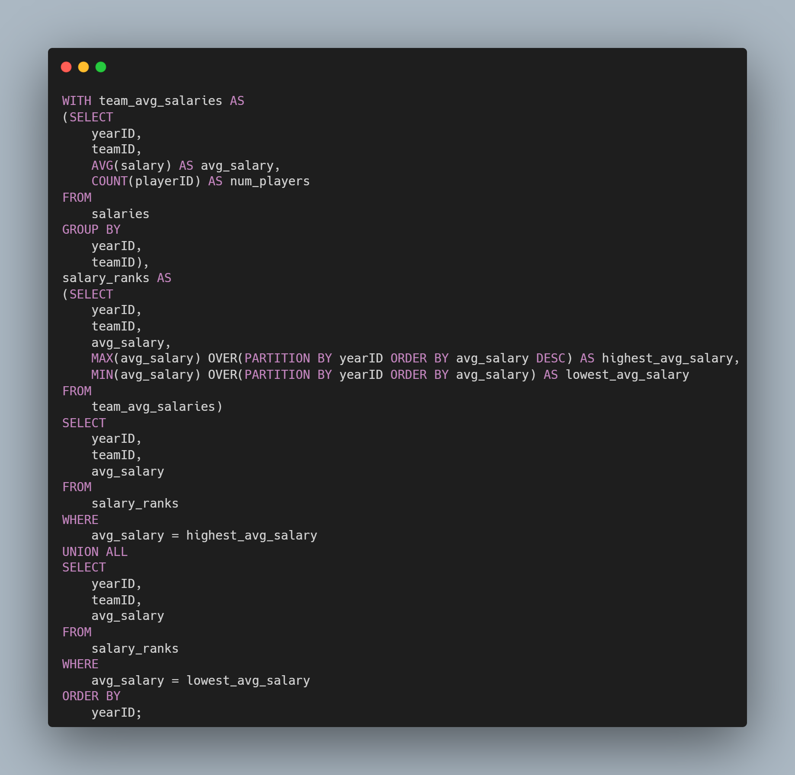
<br>
<br>
<br>
As you can see in the following chart the gap between the average salaries between
MLB Teams are increasing across years with the ***New York Yankees(NYA)*** having the highest
 average salaries between 2002 and 2013 while the lowest average salaries did not increase by
 much throughout the years.
<br>
<br>
<br>
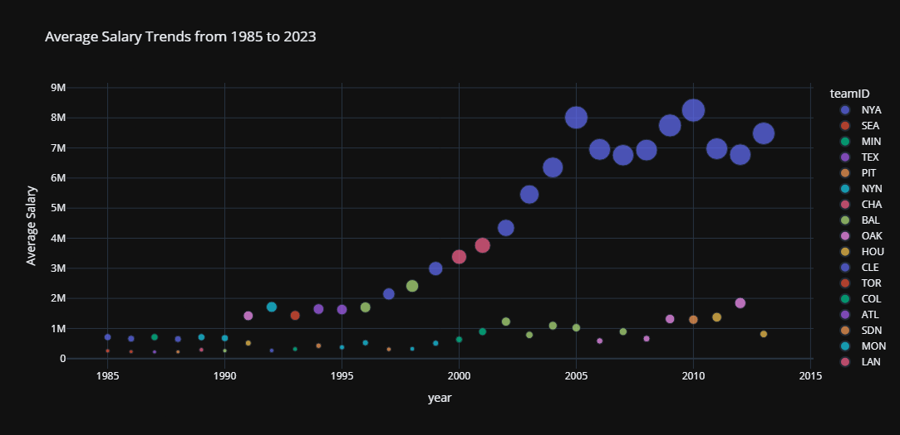

2. #### Which players had the highest salaries each year — and how did that change over time?

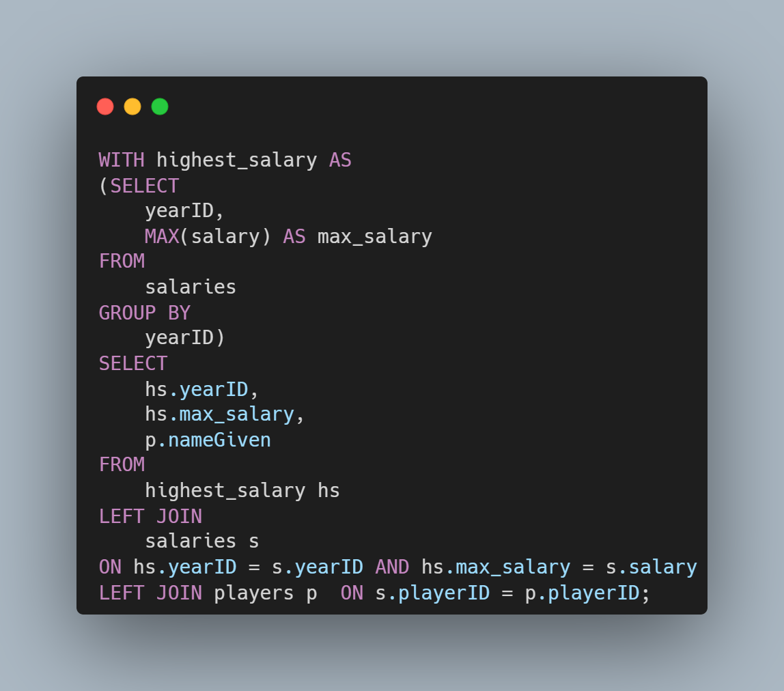
<br>
<br>
<br>
the following table has the year and the name of the player with the highest salary in
each year with their corresponding salary in millions , certain player appear more than once
throughout the year which is **Alexander Emmanuel** being the highest paid player from 2001 till
2013 with the exception of 2004 and 2007 , during this period **Alexander Emmanuel** played for the **New York Yankees(NYA)** the team that had the highest average salaries between 2002 and 2013. 
| year | max_salary   | nameGiven             |
|--------|--------------|-----------------------|
| 1985   | $2.1 million | Michael Jack          |
| 1986   | $2.8 million | George Arthur         |
| 1987   | $2.1 million | Michael Jack          |
| 1988   | $2.3 million | Osborne Earl          |
| 1989   | $2.8 million | Orel Leonard          |
| 1990   | $3.2 million | Robin R.              |
| 1991   | $3.8 million | Darryl Eugene         |
| 1992   | $6.1 million | Roberto Martin Antonio|
| 1993   | $6.2 million | Roberto Martin Antonio|
| 1994   | $6.3 million | Roberto Martin Antonio|
| 1995   | $9.2 million | Cecil Grant           |
| 1996   | $9.2 million | Cecil Grant           |
| 1997   | $10 million  | Albert Jojuan         |
| 1998   | $14.9 million| Gary Antonian         |
| 1999   | $11.9 million| Albert Jojuan         |
| 2000   | $15.7 million| James Kevin           |
| 2001   | $22 million  | Alexander Emmanuel    |
| 2002   | $22 million  | Alexander Emmanuel    |
| 2003   | $22 million  | Alexander Emmanuel    |
| 2004   | $22.5 million| Manuel Aristides      |
| 2005   | $26 million  | Alexander Emmanuel    |
| 2006   | $21.7 million| Alexander Emmanuel    |
| 2007   | $23.4 million| Jason Gilbert         |
| 2008   | $28 million  | Alexander Emmanuel    |
| 2009   | $33 million  | Alexander Emmanuel    |
| 2010   | $33 million  | Alexander Emmanuel    |
| 2011   | $32 million  | Alexander Emmanuel    |
| 2012   | $30 million  | Alexander Emmanuel    |
| 2013   | $29 million  | Alexander Emmanuel    |
| 2014   | $26 million  | Donald Zachary        |
<br>


3. ### Which teams were in the top 20% in terms of average annual spending?

.png)

Top 8 teams in terms of salary spending between 1985 and 2014 are 
1. New York Yankees
2. Boston Red Sox
3. Los Angeles Dodgers
4. Philadelphia Phillies
5. New York Mets
6. Atlanta Braves
7. Chicago Cubs
8. St. Louis Cardinals

| teamID | total_salaries |
|--------|----------------|
| NYA    | $3.3 billion   |
| BOS    | $2.4 billion   |
| LAN    | $2.2 billion   |
| PHI    | $2 billion     |
| NYN    | $2 billion     |
| ATL    | $1.9 billion   |
| CHN    | $1.9 billion   |
| SLN    | $1.8 billion   |

4. ### What is the salary maximum , minimum and average based on batting handedness (R, L, B)?

```sql
SELECT
	yearID,
    p.bats,
    MAX(s.salary) AS max_salary,
    MIN(s.salary) AS min_salary,
    ROUND(AVG(s.salary)) AS avg_salary,
    COUNT(DISTINCT p.playerID) count_unique_players
FROM
	salaries s
LEFT JOIN
	players p ON s.playerID = p.playerID
WHERE
	p.bats IS NOT NULL AND s.salary <> 0
GROUP BY
	yearID,
    p.bats;
```

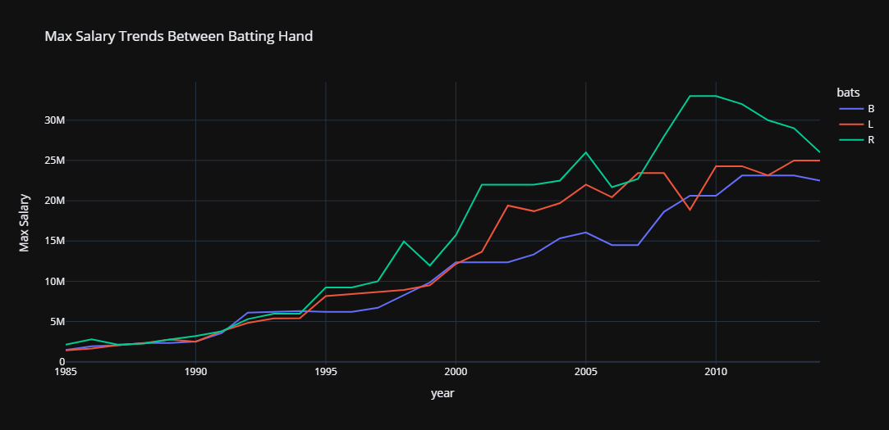
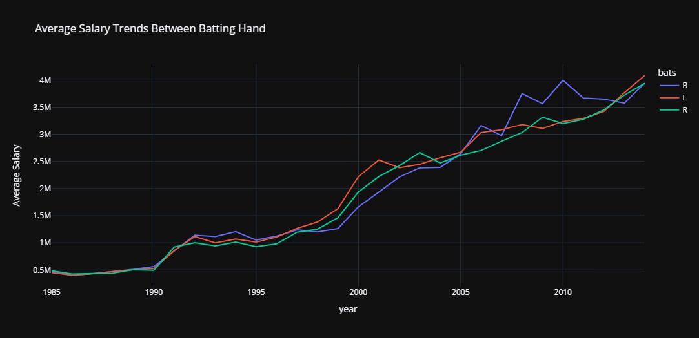
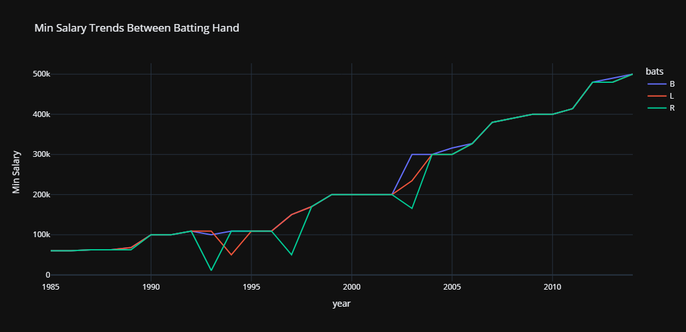

Based on the charts, the average player salary has been steadily increasing over the years, regardless of batting hand. However, the differences in average salary between batting hands (right-handed, left-handed, and switch hitters) are relatively minor.

When focusing on the top salaries, right-handed batters tend to dominate the upper end of the pay scale, earning slightly higher maximum salaries than their left-handed or switch-hitting counterparts. Interestingly, when examining the minimum salaries, right-handed batters also appear most frequently among the lowest-paid players, indicating a wider salary range within this group.

This suggests that while right-handed batters may include some of the highest-paid players, they also make up a significant portion of lower-salaried individuals, potentially due to their higher population in the league.

5. ### Salary distribution based on batting handedness (R, L, B)?
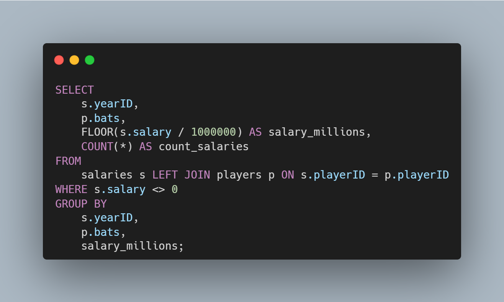

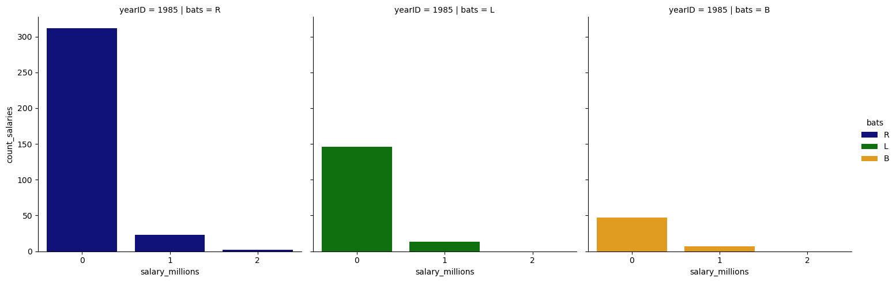
we can see from the plot above the distribution of salaries across batting hands
we can see that there is a clear increase in salary across the years and salaries tend to
be right skewed across the 3 batting hands with the majority of players tend to be right batting players


6. ### Which schools have produced the most MLB players?
.png)
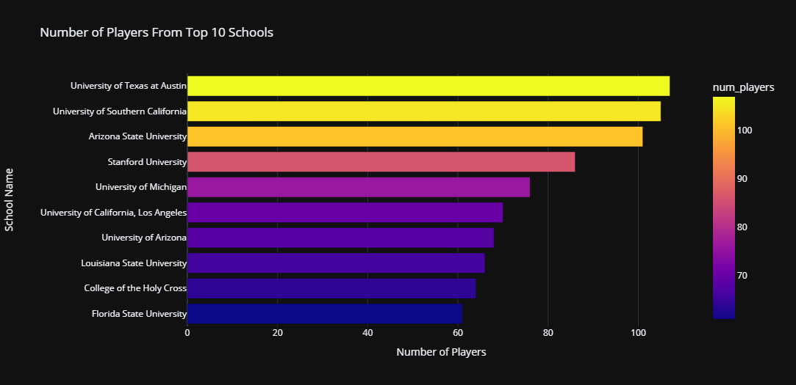
---

An interesting observation from the analysis of top schools that produce players is that the top three schools are all located in **southern states**. This suggests that there may be regional factors at play that contribute to the development of baseball talent in the South. Factors such as climate, access to resources, youth programs, and sports culture in southern states could play a significant role in nurturing future baseball players.

---
7. ### What is the distribution of batting handedness (left, right, both) across teams?
.png)
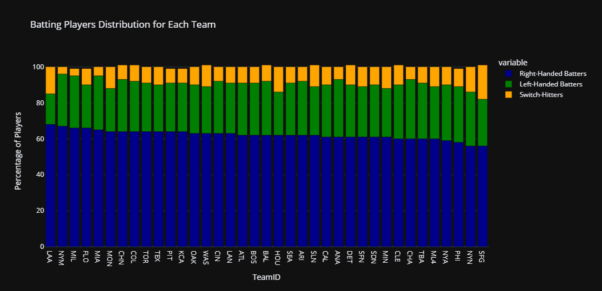

From the graph, it's evident that right-handed batters dominate in terms of numbers across teams. This trend aligns with the general demographic distribution of right-handed individuals in the population. The prevalence of right-handed batters likely influences team composition and strategy, as teams tend to have a higher proportion of right-handed players. Left-handed and switch hitters are notably fewer, which may have implications for player development and team diversity.
8. ### Which year saw the greatest growth in average salaries?
.png)
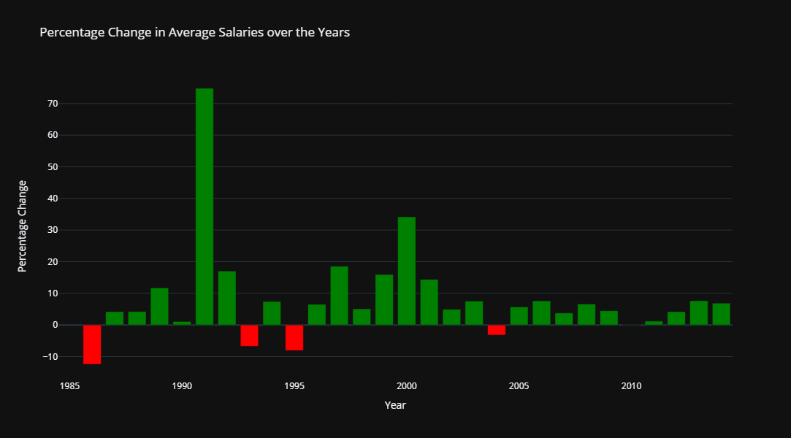

There is a big increase in average salaries in 1991 which was weird to me at first
but this is the year where media deals and free contracts were introduced that showed a big percent change between the year 1990 and 1991.

9. ### How do salary trends compare between the American League and National League?
.png)

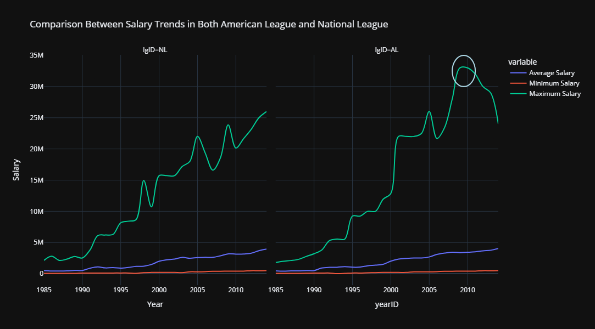

Based on the side-by-side comparison of the graphs, there is no significant difference between the average, minimum, and maximum salaries across the American and National Leagues. However, there is a noticeable trend between 2008 and 2013, where the maximum salary favored the American League. In the upcoming analysis, we will highlight a specific player associated with the peak salaries during those years (indicated by the circles in the graph).

10. ### What are the average salaries of players by school?
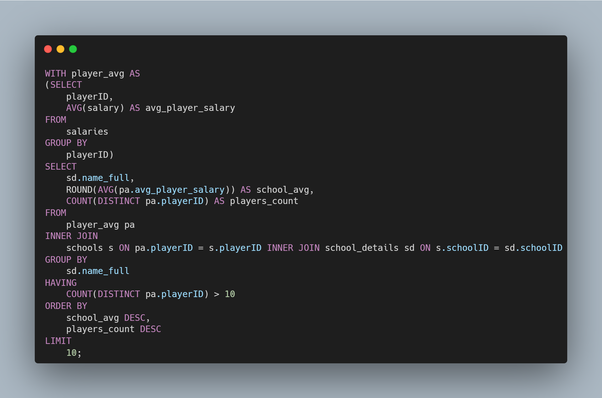
| Name Full                                | School Average Salary | Players Count |
|------------------------------------------|-----------------------|---------------|
| Missouri State University                | 2,518,167             | 11            |
| Georgia Institute of Technology          | 1,921,070             | 26            |
| San Jacinto College, North Campus        | 1,678,200             | 11            |
| Mississippi State University             | 1,647,588             | 17            |
| University of Nevada-Las Vegas           | 1,634,193             | 15            |
| University of Washington                 | 1,626,203             | 11            |
| University of South Alabama              | 1,615,321             | 12            |
| California State University Long Beach   | 1,530,826             | 30            |
| University of Miami                      | 1,495,399             | 37            |
| University of Tennessee                  | 1,467,016             | 22            |

11. ### Which player has the highest salary?
.png)
| Name                | Highest Salary |
|---------------------|----------------|
| Alexander Emmanuel  | 33 million     |

This player, who played for the New York Yankees, was frequently mentioned among the highest-paid athletes. His salary significantly contributed to the spike in both the average salaries of the Yankees and the difference in maximum salaries within the American League.

12. ### What are the geographic trends in player origins (by country)?
.png)
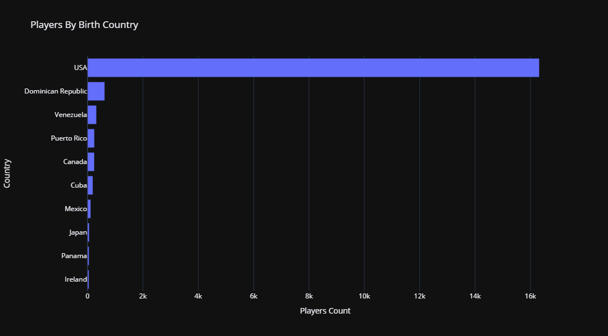

Most Players their birth Country is USA
13. ### What are the geographic trends in player origins (by state)?
.png)
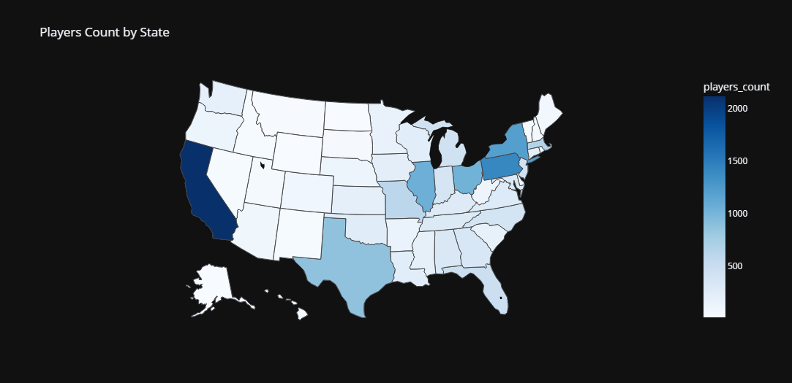

Distribution of Players across each State 
## 6.  Technologies Used
1. **MySQL**
2. **Python**
3. **Pandas**
4. **Plotly**
5. **Seaborn**
6. **Github**

## 7.  Visualizations and Demo
For visualizations, I primarily used Plotly and Seaborn in Python, along with Pandas for reading the CSV files containing the query results.

## 8.  Conclusion and Next Steps
This project provided many valuable insights for me as an analyst — both in writing complex queries and in working with advanced **MySQL** concepts. It also helped me tackle challenges related to handling large result sets and effectively visualizing the data.

Next Steps:
Moving forward, it would be interesting to explore performance metrics at both the player and team levels. Analyzing scores and their relationship to salaries could uncover potential correlations. Additionally, examining geographic influences on players — such as how location may impact their playing style or speed — could lead to deeper insights.
